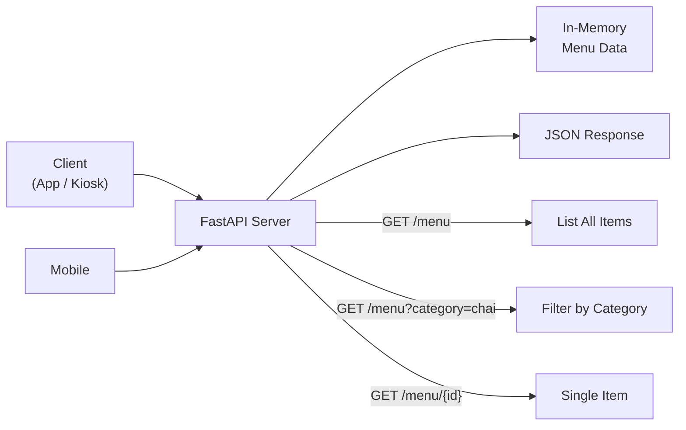
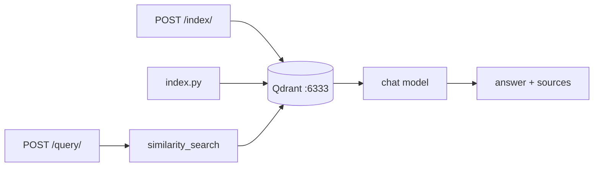
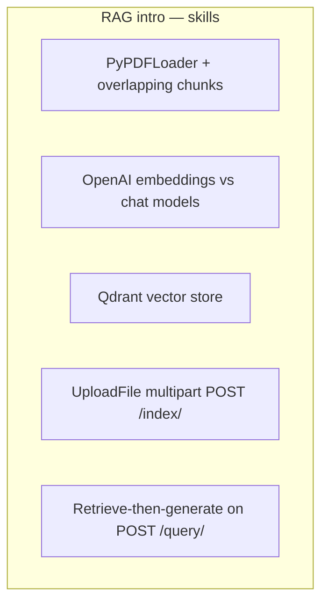
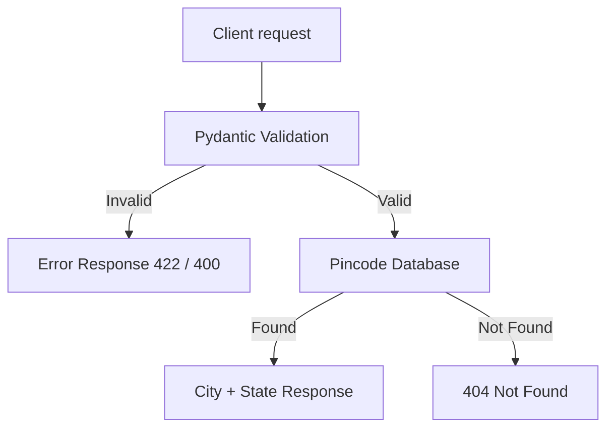
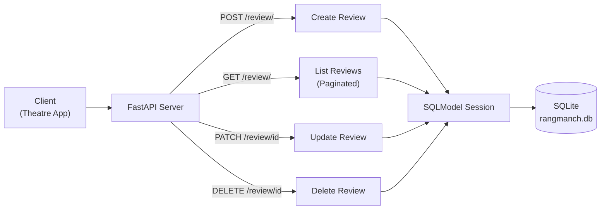
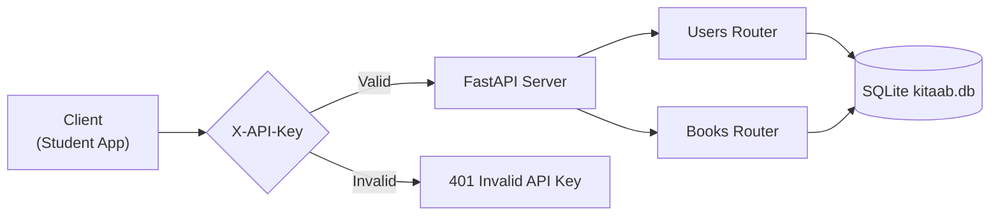

# FastAPI Projects

Course projects from a FastAPI backends track — REST APIs first, then databases, then RAG.

## Projects

| Folder | What it is | Storage |
|---|---|---|
| [chai-point](./chai-point) | Chai Point read-only menu API for kiosks and mobile | in-memory list |
| [pincode-lookup](./pincode-lookup) | Checkout auto-fill: PIN → city + state, plus bulk POST | in-memory dict |
| [rangmanch](./rangmanch) | Theatre reviews API — SQLite, SQLModel, lifespan, DI, CRUD | SQLite |
| [dabbewala](./dabbewala) | Mumbai tiffin order tracker — Enum statuses, PATCH, routers, daily stats | SQLite |
| [kitaab-exchange](./kitaab-exchange) | DU used-textbook exchange — header auth, User→Books, search listings | SQLite |
| [rag](./rag) | Ask a PDF questions — chunk, embed, Qdrant, then generate | Qdrant + OpenAI |

Notes, diagrams, and concept tables live in each folder's `README.md`.

### How the projects build

| Project | New idea |
|---|---|
| **Chai Point** | FastAPI + uvicorn, query vs path, Pydantic `response_model`, `HTTPException` |
| **Pincode lookup** | `field_validator`, custom exceptions + `add_exception_handler`, POST body vs path |
| **Rangmanch** | Lifespan, SQLModel, `Depends` session, real CRUD |
| **Dabbewala** | Enum statuses, extra routers, daily aggregation |
| **Kitaab Exchange** | `Header` dependency, API key on writes, one-to-many SQLModel, query search |
| **RAG intro** | PDF chunks, embeddings, Qdrant, `POST /index/` + `POST /query/` |

---

## Chai Point — project diagram

Chai Point, Bengaluru wants a read-only menu API so kiosk displays and mobile apps can fetch the latest menu without hitting a database.

---

## RAG intro — project diagram

Upload a PDF. Chunk it. Embed it. Ask questions. The chat model only sees the retrieved pages.

---

## Pincode lookup — project diagram

Checkout form sends a PIN. Validate first. Only valid PINs hit the directory.

Handlers are registered with `app.add_exception_handler(ErrorClass, handler)`. Bulk codes arrive in the **POST request body**, not the URL.

---

## Rangmanch — project diagram

Rangmanch, a Pune-based theatre company, needs a reviews API so audiences can rate and review plays.

Also used, not drawn above: `GET /review/{id}` and `GET /review/average/{play_name}`.

---

## Kitaab Exchange — project diagram

Delhi University students buy and sell used textbooks. Writes need `X-API-Key`. Reads are public.

---

## REST ideas that show up across the repo

| Idea | Chai Point | Pincode | Rangmanch / Dabbewala | Kitaab Exchange | RAG |
|---|---|---|---|---|---|
| Resource URL | `/menu`, `/menu/{id}` | `/pincode/{code}` | `/review/{id}` | `/users/`, `/books/{id}` | `/index/`, `/query/` |
| Query filter | `?category=chai` | — | `?play_name=&skip=&limit=` | `?title=` `?author=` | — |
| Request body | — | `POST /pincode/bulk` | `POST /review/`, `PATCH` | `POST /users/`, `POST /books/` | JSON question + multipart PDF |
| Auth | — | — | — | `X-API-Key` on writes | OpenAI key in `.env` |
| 4xx not 500 | `HTTPException` | custom handlers | `HTTPException` | `HTTPException` 401/400/404 | 400 / 500 / 503 |
| Typed JSON | Pydantic models | Pydantic + validators | SQLModel schemas | SQLModel + Relationship | Pydantic `QueryRequest` |
