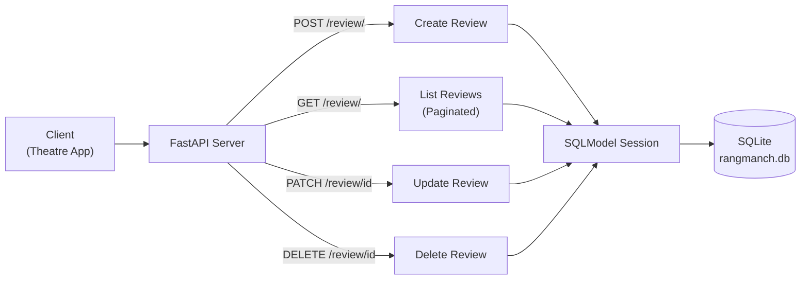
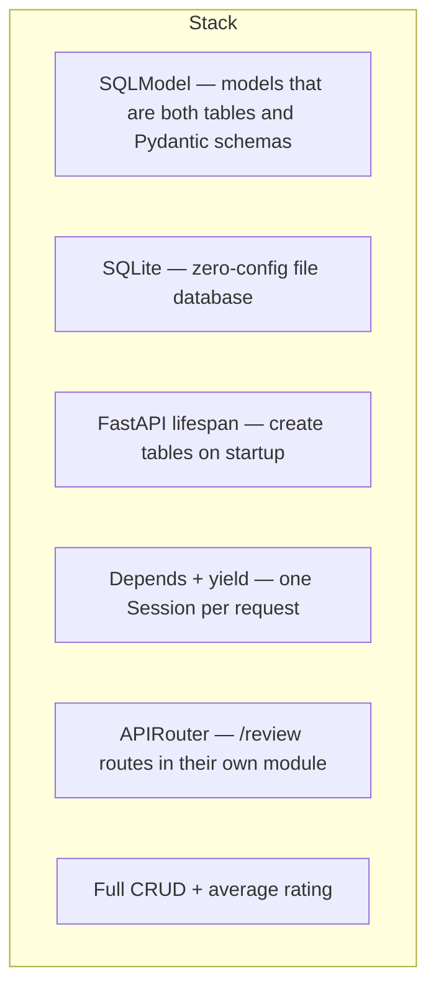

# FastAPI Projects

Course projects from FastAPI + SQLModel practice.

## Projects

| Folder | What it is |
|---|---|
| [rangmanch](./rangmanch) | Theatre reviews API — SQLite, SQLModel, lifespan, dependency injection, CRUD |
| [dabbewala](./dabbewala) | Mumbai tiffin order tracker — Enum statuses, PATCH, routers, daily aggregation |

Notes for each project live in that folder's `README.md`.

---

## Rangmanch — project diagram

Rangmanch, a Pune-based theatre company, needs a reviews API so audiences can rate and review plays. The API powers the app's review section and average rating displays.

A full CRUD API backed by SQLite — create, read, update, and delete reviews, plus average ratings per play with pagination.

Also used, not drawn above: `GET /review/{id}` and `GET /review/average/{play_name}`.

---

## Important concepts used in Rangmanch

| Concept | Where it shows up | Why it matters |
|---|---|---|
| **Lifespan** | `main.py` | Tables are created when the server starts, not on the first request |
| **SQLModel** | `models.py` | One class family for the DB row and the API body |
| **Split models** | `Review` / `ReviewCreate` / `ReviewRead` / `ReviewUpdate` | Client cannot send `id` on create or change `play_name` on PATCH |
| **SQLite** | `database.py` → `rangmanch.db` | No separate DB server; data survives restart |
| **Dependency injection** | `Depends(get_session)` | Routes never open or close the engine themselves |
| **`yield` session** | `get_session()` | Session opens before the route and closes after, even on errors |
| **APIRouter** | `routes/reviews.py` | Prefix `/review`, tag `reviews` in `/docs` |
| **CRUD verbs** | POST / GET / PATCH / DELETE | HTTP method matches the change |
| **Query params** | `play_name`, `skip`, `limit` | Filter + offset pagination |
| **Path params** | `{review_id}`, `{play_name}` | Identify one row or one play |
| **Route order** | `/average/{play_name}` before `/{review_id}` | Otherwise `average` is parsed as an int id |
| **`HTTPException`** | 404 on missing review / play | Real status codes instead of a 500 crash |
| **`exclude_unset=True`** | PATCH | Only fields the client sent are updated |
| **`func.avg` / `func.count`** | `GET /review/average/{play_name}` | Average is computed in SQL |
| **Timezone-aware datetime** | `datetime.now(timezone.utc)` | Newer SQLModel rejects naive `datetime.now()` |
| **OpenAPI docs** | `/docs` | Swagger is generated from the models and routes |

### Request flow in one line

Client → FastAPI route → `Depends(get_session)` → SQLModel → SQLite → JSON response.

### How the three projects build

| Project | Storage | New idea |
|---|---|---|
| Chai Point menu | in-memory list | routes, query filters, 404 |
| Pincode lookup | in-memory dict | custom exceptions |
| **Rangmanch** | SQLite + SQLModel | lifespan, ORM, DI, real CRUD |
| Dabbewala | SQLite + SQLModel | Enum statuses, extra routers, daily stats |

Rangmanch is the first project in this series that keeps data after the process restarts.
