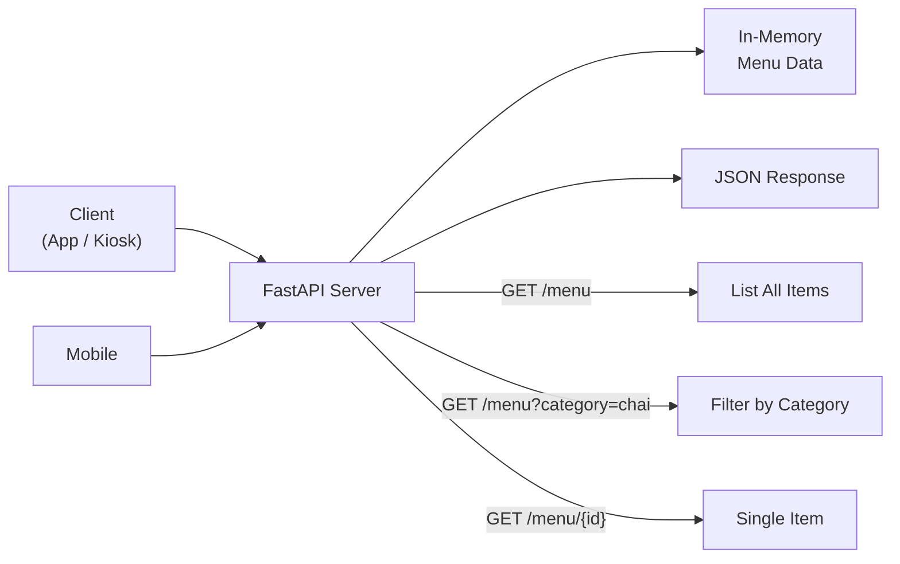
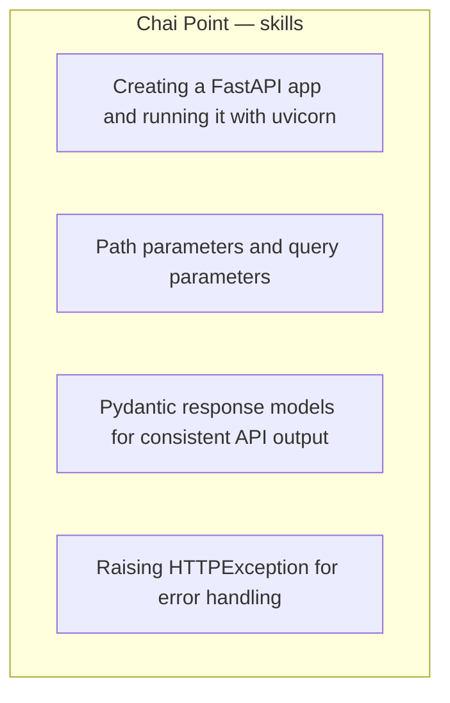

# Chai Point Menu API

Read-only menu API for Chai Point kiosk displays and mobile apps. Kiosks fetch the latest menu as JSON from **in-memory data** — no database.

Course project 1 in [FastAPI-Projects_oo1](https://github.com/yash9614/FastAPI-Projects_oo1).

## Run

```bash
cd chai-point
pip install -r requirements.txt
uvicorn main:app --reload
```

Open http://127.0.0.1:8000/docs

## Routes

| Method | Path | Result |
|---|---|---|
| `GET` | `/` | Welcome message |
| `GET` | `/menu` | All 10 items |
| `GET` | `/menu?category=chai` | Filter by `chai`, `snacks`, or `combos` |
| `GET` | `/menu/{item_id}` | One item, or `404` |

```bash
curl http://127.0.0.1:8000/menu
curl http://127.0.0.1:8000/menu?category=chai
curl http://127.0.0.1:8000/menu/1
curl http://127.0.0.1:8000/menu/99
```

## Project diagram

Client (kiosk / mobile) hits FastAPI. FastAPI reads the in-memory list and returns JSON.



Unknown category or missing id → `HTTPException` **404**.

## Dotted box — what this project teaches



## REST + FastAPI concepts learnt

| Concept | Where | Why it matters |
|---|---|---|
| **REST resource** | `/menu` is the collection, `/menu/{id}` is one member | URLs name *things*, HTTP methods say *what you do* |
| **GET is safe / read-only** | Every menu route is GET | Kiosks never mutate the menu |
| **Query parameter** | `GET /menu?category=chai` | Optional filter on the collection. Not part of the path. |
| **Path parameter** | `GET /menu/{item_id}` | Identifies one item. FastAPI parses `{item_id}` as `int`. |
| **`/menu/abc` → 422** | Path type is `int` | Validation happens before your function runs |
| **Pydantic `BaseModel`** | `models.py` → `MenuItem`, `MenuResponse` | One JSON shape for every client; `/docs` is generated from this |
| **`response_model=`** | On both menu routes | FastAPI validates the outgoing payload |
| **Default field** | `status: str = "success"` | You don't pass `status` when building `MenuResponse` |
| **In-memory store** | `data.py` → `menu_items` | Fine for a lesson; data dies when the process dies |
| **`HTTPException`** | Missing category / missing id | Real HTTP status instead of a 500 traceback |
| **Separation of files** | `models.py` / `data.py` / `main.py` | Schema, data, routes stay readable |
| **OpenAPI** | `/docs` and `/redoc` | Swagger UI comes free from the models + routes |
| **`uvicorn main:app`** | CLI | `main` is the module, `app` is the FastAPI instance |

### Query vs path (the whole point of this project)

```
GET /menu                  → collection
GET /menu?category=chai    → same collection, filtered   (query)
GET /menu/1                → one member                  (path)
```

### Request flow

Client → FastAPI route → read `menu_items` → Pydantic response model → JSON.

### Files

```
chai-point/
  main.py            routes
  models.py          MenuItem, MenuResponse
  data.py            in-memory list of 10 items
  requirements.txt   fastapi, uvicorn
```
