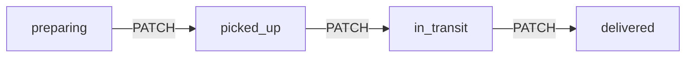
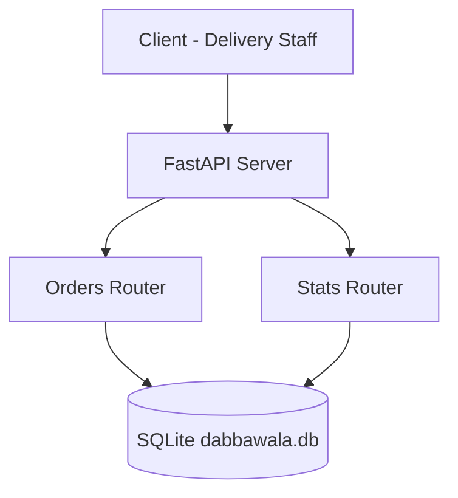

# Dabbewala Tracking API

Mumbai tiffin delivery tracker. Kitchen creates an order. Delivery staff PATCH the status at each checkpoint. Ops pulls a daily count dashboard.

Built with **FastAPI**, **SQLModel**, and **SQLite**.

## The idea

A tiffin does not get edited like a document. It *moves* through checkpoints:

```
preparing  -->  picked_up  -->  in_transit  -->  delivered
```

Skipping a stage returns **409 Conflict**. The current status lives on `Order`. The path it took lives in `StatusLog`.

## Flowchart





Same picture in dotted ASCII if mermaid does not render:

```
  +--------------------------------------------------------------+
  |  Mumbai tiffin service tracks orders from kitchen to door    |
  +--------------------------------------------------------------+

     preparing --> picked_up --> in_transit --> delivered

            Client (Delivery Staff)
                     |
                     v
              FastAPI Server
                /         \
               v           v
        Orders Router   Stats Router
                \         /
                 v       v
           SQLite (dabbawala.db)

  +--------------------------------------------------------------+
  |  Enum statuses                                               |
  |  PATCH for partial updates (vs PUT for full replacement)     |
  |  DateTime + date filters                                     |
  |  Multiple query params together                              |
  |  Aggregation for the daily dashboard                         |
  |  Multiple routers in one app                                 |
  +--------------------------------------------------------------+
```

## Run

```bash
cd dabbewala
pip install -r requirements.txt
python -m uvicorn main:app --reload
```

- App: http://127.0.0.1:8000
- Docs: http://127.0.0.1:8000/docs

On Windows, prefer `python -m uvicorn` if `uvicorn` is not on PATH.

## Project layout

```
dabbewala/
  main.py              # app, lifespan, mounts both routers
  database.py          # engine, create_tables, get_session
  models.py            # Enum, Order, OrderCreate, OrderUpdate, StatusLog
  requirements.txt
  routes/
    __init__.py
    orders.py          # create, list, get, patch, logs
    stats.py           # GET /stats/daily
  dabbawala.db         # created on first startup (not committed)
```

## Data model

```
OrderStatus (Enum) -> preparing, picked_up, in_transit, delivered

Order                         OrderCreate              OrderUpdate
-----                         -----------              -----------
id (primary key)              customer_name            status (optional)
customer_name (str)           delivery_address         delivery_address (optional)
delivery_address (str)        items
items (str)
status (OrderStatus)
created_at
updated_at

StatusLog
---------
order_id
old_status
new_status
changed_at
```

Four shapes on purpose:

| Model | Role | In the database? |
|---|---|---|
| `Order` | current snapshot of a tiffin | yes |
| `OrderCreate` | POST body — kitchen cannot set status | no |
| `OrderUpdate` | PATCH body — rider sends only what changed | no |
| `StatusLog` | history of each legal jump | yes |

A new order always starts as `preparing`. That default is on the table, not on the client.

## Endpoints

| Method | Path | What it does |
|---|---|
| GET | `/` | Welcome + status flow |
| GET | `/health` | Liveness check |
| POST | `/orders/` | Create order (`preparing`) |
| GET | `/orders/` | List + filter (`status`, `created_date`, `skip`, `limit`) |
| GET | `/orders/{order_id}` | One order |
| GET | `/orders/{order_id}/logs` | Status history |
| PATCH | `/orders/{order_id}` | Update status and/or address |
| GET | `/stats/daily` | Counts by status for a day |

Create body:

```json
{
  "customer_name": "Rajesh Mehta",
  "delivery_address": "Fort, Mumbai",
  "items": "Dal, rice, 2 roti"
}
```

Move it one checkpoint:

```bash
curl -X PATCH http://127.0.0.1:8000/orders/1 \
  -H "Content-Type: application/json" \
  -d "{\"status\": \"picked_up\"}"
```

Daily dashboard:

```bash
curl http://127.0.0.1:8000/stats/daily
curl "http://127.0.0.1:8000/orders/?status=preparing&created_date=2026-09-27"
```

---

## Important methods and concepts

### 1. `OrderStatus(str, Enum)`

A plain `str` would accept `"preparng"` and corrupt data. The enum is a closed set. Mixing `str` in means JSON stays `"preparing"` and `/docs` shows a dropdown.

```python
class OrderStatus(str, Enum):
    PREPARING = "preparing"
    PICKED_UP = "picked_up"
    IN_TRANSIT = "in_transit"
    DELIVERED = "delivered"
```

### 2. Split models (`Order` / `OrderCreate` / `OrderUpdate`)

Who is allowed to send what is different:

- Kitchen sends name, address, items. Not `status="delivered"`.
- Rider sends `{ "status": "picked_up" }`. Not a rewritten `customer_name`.
- `id`, `created_at`, `updated_at` are owned by the server.

That is why create and update are different classes.

### 3. PATCH vs PUT — `model_dump(exclude_unset=True)`

PUT means "here is the full new document." PATCH means "here are the fields that changed."

`exclude_unset=True` keeps omitted fields off the dict. Sending `{ "status": "picked_up" }` does **not** wipe `delivery_address` to `None`.

```python
data = payload.model_dump(exclude_unset=True)
```

### 4. `apply_status_change`

The flowchart is enforced in code, not by hope.

```python
NEXT_STATUS = {
    OrderStatus.PREPARING: OrderStatus.PICKED_UP,
    OrderStatus.PICKED_UP: OrderStatus.IN_TRANSIT,
    OrderStatus.IN_TRANSIT: OrderStatus.DELIVERED,
    OrderStatus.DELIVERED: None,
}
```

- Same status again → no-op.
- Already delivered → 409.
- Jump that skips a box → 409 (`preparing` → `delivered` is illegal).
- Legal jump → write `StatusLog`, then update `Order.status`.

409 means "the resource cannot make that move." 400 means "your JSON is wrong." 404 means "no such order."

### 5. `StatusLog`

`Order` only knows the *current* checkpoint. The log knows the *path*:

```
preparing → picked_up → in_transit → delivered
```

Read it with `GET /orders/{id}/logs`.

### 6. Lifespan + `create_tables`

```python
@asynccontextmanager
async def lifespan(app: FastAPI):
    create_tables()
    yield
```

Code before `yield` runs once at startup. Tables exist before the first request. `SQLModel.metadata.create_all` only sees models that have been imported — that is why `main.py` imports `Order` and `StatusLog`.

### 7. `get_session` + `Depends`

```python
def get_session():
    with Session(engine) as session:
        yield session
```

FastAPI opens a session, runs the route, then closes it even if the route raised. One request = one session. Routes never touch `engine` directly.

### 8. Multiple query params on `list_orders`

```
GET /orders/?status=preparing&created_date=2026-09-27&skip=0&limit=20
```

Start from `select(Order)` and only add `.where(...)` when that param is present. Unused filters stay off the SQL.

`created_at` is a timestamp. The client sends a *day*. Build a window:

```python
start = datetime.combine(created_date, datetime.min.time())
end = datetime.combine(created_date, datetime.max.time())
```

### 9. `daily_summary` — aggregation

`/stats/daily` does not return orders. It returns counts.

```python
select(func.count(Order.id)).where(
    Order.created_at >= start,
    Order.created_at <= end,
    Order.status == status,
)
```

Looping `for status in OrderStatus` means a new enum value later shows up on the dashboard automatically.

### 10. Two routers in one app

```python
router = APIRouter(prefix="/orders", tags=["orders"])
router = APIRouter(prefix="/stats", tags=["stats"])

app.include_router(orders_router)
app.include_router(stats_router)
```

`main.py` is only the entrance. Orders and the dashboard are different rooms.

- `prefix` — every path on that router starts with `/orders` or `/stats`
- `tags` — groups them in `/docs`

### 11. Timezone-aware datetimes

Newer SQLModel rejects naive `datetime.now()`. Store UTC:

```python
created_at: datetime = Field(default_factory=lambda: datetime.now(timezone.utc))
```

---

## How this sits after Rangmanch

| Project | New idea |
|---|---|
| Chai Point | in-memory list, query filters |
| Pincode | custom exceptions |
| Rangmanch | SQLite, lifespan, CRUD, one router |
| **Dabbewala** | Enum workflow, PATCH + audit log, two routers, date filters, daily aggregation |
