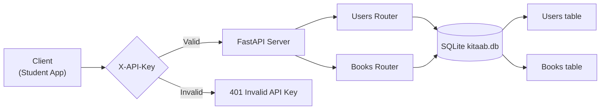
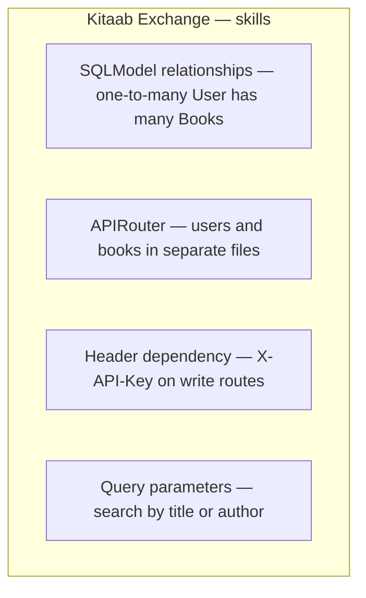

# Kitaab Exchange API

Delhi University used-textbook marketplace. Sellers list a book with a price. Buyers search by title or author. After a sale the seller marks the listing as sold.

Writes are locked with an `X-API-Key` header. Reads are public.

Built with **FastAPI**, **SQLModel**, and **SQLite**.

## The idea

```
Client (Student App)
        |
        v
  X-API-Key check
     /        \
 Valid       Invalid
   |            |
   v            v
FastAPI     401 Invalid API Key
   |
   +-- Users Router --> SQLite --> Users table
   +-- Books Router --> SQLite --> Books table
```

One user has many books (`user_id` foreign key).

## Flowchart





## Run

```bash
cd kitaab-exchange
pip install -r requirements.txt
python -m uvicorn main:app --reload
```

On Windows, use `python -m uvicorn` if `uvicorn` is not on PATH.

- App: http://127.0.0.1:8000
- Docs: http://127.0.0.1:8000/docs

Write endpoints need header:

```text
X-API-Key: my_secret_api_key
```

## Project layout

```
kitaab-exchange/
  main.py              # app, startup create_tables, mount routers
  database.py          # engine, create_tables, get_session
  auth.py              # Header() + verify_api_key
  requirements.txt
  models/
    __init__.py
    user.py            # User, UserCreate, UserRead
    book.py            # Book, BookCreate, BookRead, BookUpdate
  routes/
    __init__.py
    users.py           # POST /users/, GET /users/
    books.py           # list, create, patch, mark sold
  kitaab.db            # created on first startup (not committed)
```

## Data model

```
User                          Book
----                          ----
id                            id
name                          title
email (unique)                author
college                       price
books 1—* Book                is_sold (default False)
                              user_id → user.id
                              owner *—1 User
```

| Model | Role | In the database? |
|---|---|---|
| `User` / `Book` | tables + relationship | yes |
| `UserCreate` / `BookCreate` | POST body | no |
| `UserRead` / `BookRead` | response | no |
| `BookUpdate` | PATCH — only `price` and/or `is_sold` | no |

## Endpoints

| Method | Path | Key? | What it does |
|---|---|---|---|
| GET | `/` | no | Welcome |
| POST | `/users/` | yes | Register (name, email, college) |
| GET | `/users/` | no | List users |
| GET | `/books/` | no | Unsold books; `?title=` `?author=` |
| POST | `/books/` | yes | List a book (`user_id` required) |
| PATCH | `/books/{book_id}` | yes | Update price / is_sold |
| PATCH | `/books/{book_id}/sold` | yes | Mark sold; drops out of GET /books/ |

Missing header → **422**. Wrong key → **401**. Duplicate email → **400**. Unknown book → **404**.

```bash
curl -X POST http://127.0.0.1:8000/users/ \
  -H "Content-Type: application/json" \
  -H "X-API-Key: my_secret_api_key" \
  -d '{"name":"Aisha","email":"aisha@du.ac.in","college":"Hindu College"}'

curl -X POST http://127.0.0.1:8000/books/ \
  -H "Content-Type: application/json" \
  -H "X-API-Key: my_secret_api_key" \
  -d '{"title":"NCERT Physics","author":"NCERT","price":120,"user_id":1}'

curl "http://127.0.0.1:8000/books/?title=Physics"

curl -X PATCH http://127.0.0.1:8000/books/1/sold \
  -H "X-API-Key: my_secret_api_key"
```

---

## Important methods and concepts

### 1. Header dependency

```python
def verify_api_key(x_api_key: str = Header()):
    if x_api_key != API_KEY:
        raise HTTPException(status_code=401, detail="Invalid API Key")
    return x_api_key
```

`Header()` turns `x_api_key` into the `X-API-Key` request header. Attach it only on writes:

```python
api_key: str = Depends(verify_api_key)
```

This is not JWT and not OAuth. One shared key for write operations.

### 2. `APIRouter`

```python
router = APIRouter(prefix="/users", tags=["users"])
router = APIRouter(prefix="/books", tags=["books"])

app.include_router(users.router)
app.include_router(books.router)
```

`main.py` is only the entrance. Users and books are different rooms.

### 3. One-to-many with SQLModel

```python
class User(SQLModel, table=True):
    books: list["Book"] = Relationship(back_populates="owner")

class Book(SQLModel, table=True):
    user_id: int = Field(foreign_key="user.id")
    owner: Optional["User"] = Relationship(back_populates="books")
```

Quoted `"Book"` / `"User"` are forward references so the two files do not import each other at runtime (`TYPE_CHECKING` only).

### 4. Query parameters

```python
title: Optional[str] = Query(default=None)
author: Optional[str] = Query(default=None)
```

Becomes `GET /books/?title=Physics`. Filters stack with `.where()`. Listing always hides `is_sold == True`.

### 5. PATCH + `exclude_unset=True`

Sending `{"price": 90}` must not reset `is_sold`. `model_dump(exclude_unset=True)` only applies fields the client actually sent.

---

## How this sits after Dabbewala

| Project | New idea |
|---|---|
| Chai Point | in-memory list, query filters |
| Pincode | custom exceptions |
| Rangmanch | SQLite, lifespan, CRUD, one router |
| Dabbewala | Enum workflow, PATCH + audit log, two routers, daily stats |
| **Kitaab Exchange** | header auth, one-to-many relationship, split model files |
