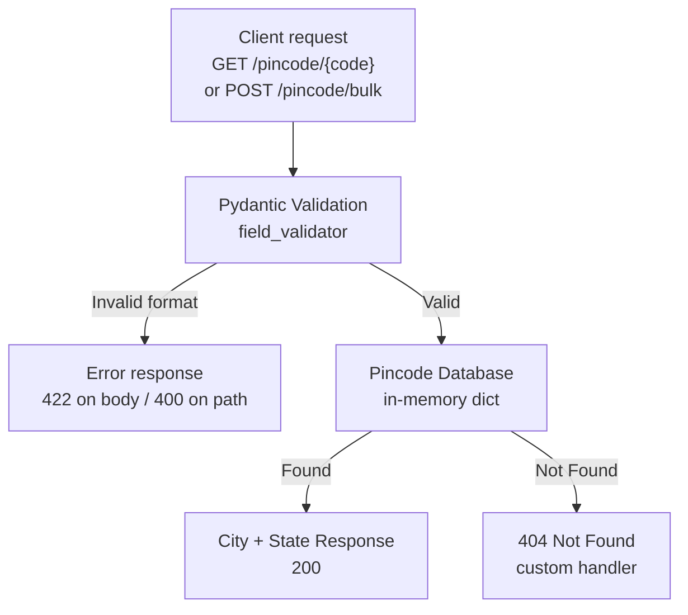
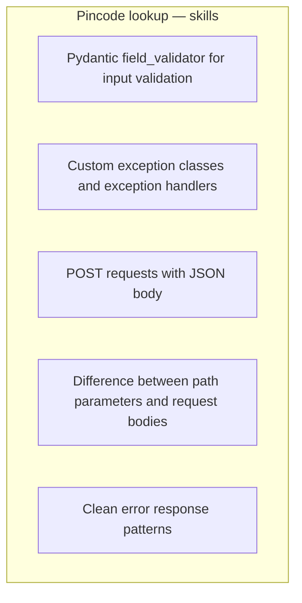

# Pincode Lookup API

Checkout auto-fill: send an Indian PIN, get city + state. Invalid format is rejected **before** the directory is searched.

Course project 2 in [FastAPI-Projects_oo1](https://github.com/yash9614/FastAPI-Projects_oo1).

## Run

```bash
cd pincode-lookup
pip install -r requirements.txt
uvicorn main:app --reload --port 8001
```

Open http://127.0.0.1:8001/docs

## Routes

| Method | Path | Body | Result |
|---|---|---|---|
| `GET` | `/` | — | Welcome |
| `GET` | `/pincode/{code}` | — | One location, or custom 404 / 400 |
| `POST` | `/pincode/bulk` | `{ "pincodes": ["411001", "560001"] }` | Found + missing lists |

```bash
curl http://127.0.0.1:8001/pincode/411001
curl http://127.0.0.1:8001/pincode/999999
curl http://127.0.0.1:8001/pincode/abc123
curl -X POST http://127.0.0.1:8001/pincode/bulk \
  -H "Content-Type: application/json" \
  -d '{"pincodes":["411001","560001","000000"]}'
```

## Project diagram



Path vs body:

- **Path** — `GET /pincode/411001` — one code in the URL.
- **Body** — `POST /pincode/bulk` — list of codes in JSON. Bulk data cannot live in the path.

## Dotted box — what this project teaches



## REST + FastAPI concepts learnt

| Concept | Where | Why it matters |
|---|---|---|
| **Validate then lookup** | Diagram flow | 6-digit garbage never hits the directory |
| **`@field_validator`** | `PincodeRequest`, `BulkRequest` | Extra rules beyond `str` / `list` |
| **422 Unprocessable Entity** | Bad JSON body (`"ab"`, empty list, >20 codes) | Pydantic failed — FastAPI's default |
| **Custom exception class** | `PinCodeNotFoundError`, `InvalidPinCodeError` | Routes `raise` domain errors, not raw dicts |
| **`app.add_exception_handler(ErrorClass, handler)`** | `main.py` | One handler for every route that raises that class |
| **Clean error JSON** | `exceptions.py` handlers | `{ "error", "message", "pincode" }` instead of a stack trace |
| **Path parameter** | `GET /pincode/{code}` | One identifier in the URL |
| **Request body + POST** | `POST /pincode/bulk` + `BulkRequest` | A list does not belong in the path |
| **`response_model`** | `LocationResponse`, `BulkResponse` | Outgoing JSON stays stable |
| **Partial success** | Bulk: `found` + `missing` | One bad PIN in a batch does not fail the whole POST |
| **In-memory dict** | `data.py` → `pincode_db` | Key = PIN string, value = city / state / district |

### How handlers connect (the quiz question)

```python
app.add_exception_handler(PinCodeNotFoundError, pincode_not_found_handler)
app.add_exception_handler(InvalidPinCodeError, invalid_pincode_handler)
```

Handlers are **not** auto-detected by name. You register the class → function pair. Then any route can `raise PinCodeNotFoundError(code)` and the handler builds the 404 JSON.

Bulk data arrives in the **POST body**, not the path or query string:

```python
@app.post("/pincode/bulk")
def bulk_lookup(request: BulkRequest):
    ...
```

### Status codes used

| Code | When |
|---|---|
| 200 | PIN found, or bulk ran |
| 400 | Path PIN is not 6 digits (`InvalidPinCodeError` handler) |
| 404 | Well-formed PIN, not in the dict (`PinCodeNotFoundError` handler) |
| 422 | POST body failed `field_validator` |

### Request flow

Client → FastAPI → Pydantic (body) or manual digit check (path) → dict lookup → model or custom handler.

### Files

```
pincode-lookup/
  main.py            routes + add_exception_handler
  models.py          PincodeRequest, LocationResponse, BulkRequest, BulkResponse
  data.py            pincode_db
  exceptions.py      error classes + JSON handlers
  requirements.txt   fastapi, uvicorn
```
