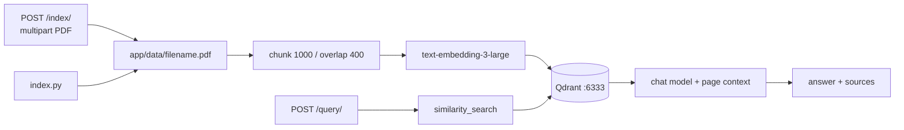
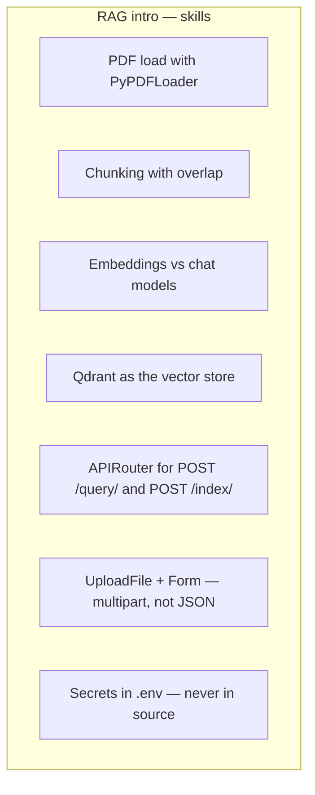

# RAG API

Intro RAG project from the FastAPI + GenAI track. A PDF is split, embedded, and stored in Qdrant. FastAPI accepts a question, retrieves the nearest chunks, and asks an LLM to answer only from that context — with page numbers.

Built with **FastAPI**, **LangChain**, **OpenAI**, and **Qdrant**.

## The idea

```
PDF (sample.pdf or POST /index/ upload)
    |
    v
load → split → embed → store
    |
    v
Qdrant collection: sample_collection
    ^
    |
POST /query/  { "question": "What is RAG?" }
    |
    v
similarity search + chat model
    |
    v
{ question, answer, sources[] }
```

The language model never sees the whole PDF. It only sees the chunks Qdrant ranked as closest to the question.

## Flowchart





## Run

```bash
cd rag
cp .env.example .env
# put a real OPENAI_API_KEY in .env

docker compose up -d
pip install -r requirements.txt
python -m uvicorn main:app --reload
```

`index.py` still works. You can skip it and upload from `/docs` instead.

- App: http://127.0.0.1:8000
- Docs: http://127.0.0.1:8000/docs
- Qdrant UI: http://localhost:6333/dashboard

```bash
curl -X POST http://127.0.0.1:8000/index/ \
  -F "file=@app/data/sample.pdf" \
  -F "replace=true"

curl -X POST http://127.0.0.1:8000/query/ \
  -H "Content-Type: application/json" \
  -d '{"question":"What is RAG?"}'
```

Try also: `Which port does Qdrant use?` and `What chunk size does the indexer use?`

## Project layout

```
rag/
  app/
    rag.py                 # load / split / embed / Qdrant helpers
    data/
      sample.pdf
    routes/
      index.py             # POST /index/
      query.py             # POST /query/
  index.py                 # optional CLI — calls app.rag.index_pdf
  main.py
```

## Endpoints

| Method | Path | Body | What it does |
|---|---|---|---|
| GET | `/` | — | Name and how to call the API |
| POST | `/index/` | multipart `file` + `replace` | Save PDF under `app/data/`, chunk, embed, store |
| POST | `/query/` | `{ "question": "..." }` | Retrieve chunks, ask the chat model |

Missing Qdrant or an unindexed collection → **503**. Missing `OPENAI_API_KEY` → **500**.

## Important methods and concepts

### 1. Indexing is a route (CLI still works)

Same pipeline lives in `app/rag.py`. `POST /index/` and `python index.py` both call `index_pdf()`.

`replace=true` deletes the collection first. `replace=false` adds the new chunks next to whatever is already there.

### 2. Chunk size vs overlap

| Setting | Course value | Why |
|---|---|---|
| `chunk_size` | 1000 | Fits embedding / prompt limits |
| `chunk_overlap` | 400 | A sentence on a cut boundary still has neighbours |

### 3. Two OpenAI models

| Job | Env var | Default |
|---|---|---|
| Turn text into vectors | `OPENAI_EMBEDDING_MODEL` | `text-embedding-3-large` |
| Write the answer | `OPENAI_CHAT_MODEL` | `gpt-4o-mini` |

### 4. Secrets stay in `.env`

Copy `.env.example` to `.env`. Never commit the real key.

## How this sits after Kitaab Exchange

| Project | New idea |
|---|---|
| Chai Point | in-memory list, query filters |
| Pincode | custom exceptions |
| Rangmanch | SQLite, lifespan, CRUD |
| Dabbewala | Enum workflow, two routers, daily stats |
| Kitaab Exchange | header auth, one-to-many |
| **RAG intro** | embeddings, vector DB, retrieve-then-generate |
