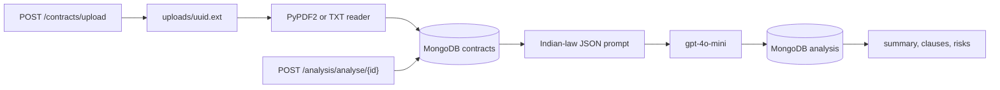
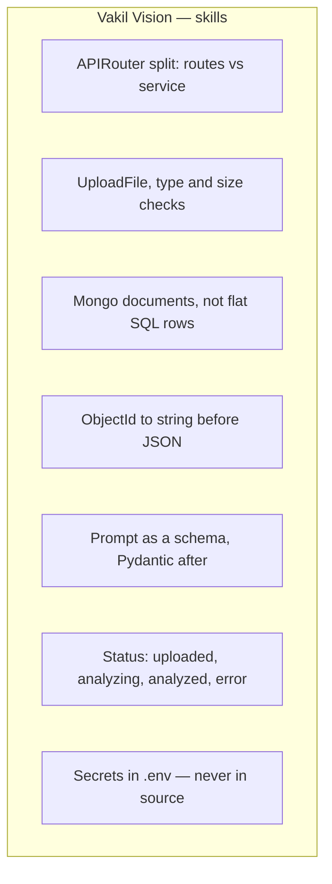

# Vakil Vision API

Contract review API from the FastAPI + GenAI track. A PDF or TXT contract is uploaded, parsed, and stored in MongoDB. OpenAI then returns a structured reading: summary, key clauses, risk flags, and recommendations under Indian contract law.

Built with **FastAPI**, **MongoDB**, **PyPDF2**, and **OpenAI**. The course snapshot called Gemini. This folder uses an OpenAI key instead. The service file is still named `gemini_analyse.py` so it matches the course layout.

This is a study aid, not legal advice.

## The idea

```
PDF or TXT
    |
    v
POST /contracts/upload
    |
    v
save file → extract text → MongoDB contracts
    |
    v
POST /analysis/analyse/{contract_id}
    |
    v
prompt + JSON schema → OpenAI → MongoDB analysis
```

Unlike the RAG project, the model sees the contract text itself (first 15,000 characters), not retrieved chunks.

## Flowchart





## Run

```bash
cd vakil-vision
cp app/.env.example app/.env
# put a real OPENAI_API_KEY in app/.env

docker compose up -d
pip install -r requirements.txt
uvicorn app.main:app --reload
```

With uv, from the project root:

```bat
uv pip install -r requirements.txt
docker compose up -d
uv run uvicorn app.main:app --reload
```

- App: http://127.0.0.1:8000
- Docs: http://127.0.0.1:8000/docs

```bash
curl -F "file=@samples/sample_nda.txt" http://127.0.0.1:8000/contracts/upload
curl -X POST http://127.0.0.1:8000/analysis/analyse/<contract_id>
curl http://127.0.0.1:8000/analysis/contract/<contract_id>
```

The id is the 24-character value in the upload response, not the filename. Mongo must be up before uvicorn: startup creates indexes.

## Project layout

```
vakil-vision/
  app/
    main.py
    config.py
    database.py
    models.py
    routes/
      contracts.py          # upload, list, get
      analysis.py           # analyse, list, get
    service/
      document_parser.py
      gemini_analyse.py     # OpenAI call
      prompt.py
  samples/sample_nda.txt
  docker-compose.yml
  requirements.txt
```

Raw uploads land in `uploads/` and are gitignored. Parsed text and analysis live in the `vakil_vision` database, volume `vakil_mongo_data`.

## Endpoints

| Method | Path | What it does |
|---|---|---|
| GET | `/` | Name and endpoint map |
| POST | `/contracts/upload` | PDF or TXT, max 10 MB. Stores text |
| GET | `/contracts/` | List contracts, text omitted |
| GET | `/contracts/{id}` | One contract, including text |
| POST | `/analysis/analyse/{contract_id}` | OpenAI analysis, then store it |
| GET | `/analysis/` | All analyses |
| GET | `/analysis/{analysis_id}` | One analysis |
| GET | `/analysis/contract/{contract_id}` | Analyses for one contract |

Missing key → **500**. Bad id → **400**. Unknown contract → **404**. Model or JSON failure → **502**, contract status `error`.

## Important methods and concepts

### 1. Routes do HTTP, services do work

`contracts.py` checks the file and writes Mongo. `document_parser.py` only extracts text. `analysis.py` loads the contract and stores the result. `gemini_analyse.py` is the only file that talks to OpenAI.

### 2. A contract is a document

Clauses and risk flags are nested lists. Mongo collections `contracts` and `analysis` are linked by `contract_id`. A Database object cannot be used with `or`; compare with `None`. ObjectId is converted to a string before the response.

### 3. The model fills a schema

The prompt asks for `summary`, `contract_type`, `key_clauses`, `risk_flags`, `overall_risk_level`, and `recommendations`. `response_format={"type": "json_object"}` plus `ClauseAnalysis` and `RiskFlag` is what makes that output code, not a paragraph. Only the first 15,000 characters are sent.

### 4. Status is the job state

`uploaded` → `analyzing` → `analyzed` or `error`. Same idea as Dabbewala's delivery states, applied to an AI call.

### 5. Route order

`GET /analysis/contract/{contract_id}` is registered before `GET /analysis/{analysis_id}`. Otherwise the word `contract` is captured as an id.

## How this sits after the RAG intro

| Project | New idea |
|---|---|
| Chai Point | in-memory list, query filters |
| Pincode | custom exceptions |
| Rangmanch | SQLite, lifespan, CRUD |
| Dabbewala | Enum workflow, two routers, daily stats |
| Kitaab Exchange | header auth, one-to-many |
| RAG intro | embeddings, vector DB, retrieve-then-generate |
| **Vakil Vision** | file upload, Mongo documents, model forced into JSON |
