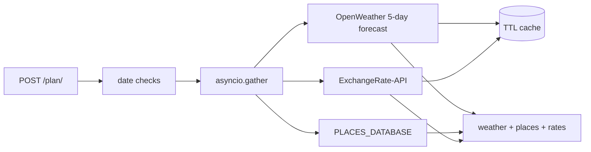
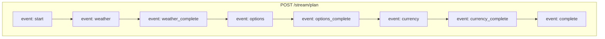
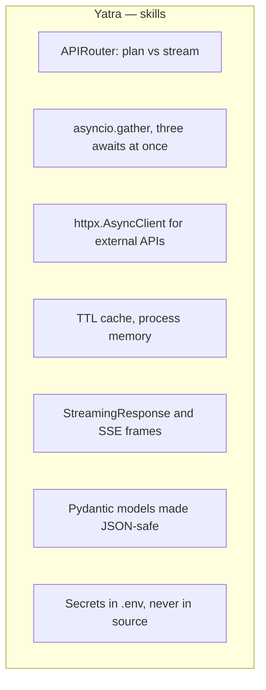

# Yatra Planner API

Travel plan API from the FastAPI + GenAI track. One request asks three sources at once: weather, a static places list, and live exchange rates. A second route streams the same work as server-sent events.

Built with **FastAPI**, **httpx**, **Pydantic**, and an in-memory TTL cache. The course snapshot called WeatherAPI.com and hardcoded both keys. This folder uses an OpenWeatherMap key (`OPENWEATHER_API_KEY`) and an ExchangeRate-API key (`EXCHANGE_RATE_API_KEY`) from `.env`.

Destinations with places data: `goa`, `manali`, `jaipur`. Any other name still returns weather and rates, with an empty places list.

## The idea

```
POST /plan/  or  POST /stream/plan
        |
        v
date checks (order, 1 to 14 days)
        |
        v
asyncio.gather
   |            |            |
weather      places       currency
OpenWeather  dict lookup  ExchangeRate-API
        |
        v
one JSON body   or   SSE events
```

`/plan/` waits until all three finish. `/stream/plan` yields a line after each step so the client is not silent for the whole wait.

## Flowchart







## Run

```bash
cd yatra
cp .env.example .env
# OPENWEATHER_API_KEY and EXCHANGE_RATE_API_KEY

uv venv
uv pip install -r requirements.txt
uvicorn app.main:app --reload
```

On Windows, activate with `.venv\Scripts\activate`. `uvloop` is left out of `requirements.txt` because it does not install on Windows. Uvicorn uses the default event loop.

- App: http://127.0.0.1:8000
- Docs: http://127.0.0.1:8000/docs

```bash
curl -X POST http://127.0.0.1:8000/plan/ \
  -H "Content-Type: application/json" \
  -d '{"destination":"goa","start_date":"2026-10-03","end_date":"2026-10-05","base_currency":"INR"}'

curl -N -X POST http://127.0.0.1:8000/stream/plan \
  -H "Content-Type: application/json" \
  -d '{"destination":"goa","start_date":"2026-10-03","end_date":"2026-10-05","base_currency":"INR"}'
```

Swagger shows `Undocumented / Error: OK` on the stream route. That is the docs UI failing to render `text/event-stream`. `curl -N` is the check that matters.

Free OpenWeatherMap forecast is about 5 days. Dates further out come back with an empty weather list, not an error.

```bash
python -m unittest tests.test_stream_serialization
```

## Project layout

```
yatra/
  app/
    main.py
    model.py
    routes/
      planner.py          # POST /plan/
      stream.py           # POST /stream/plan
    services/
      cache.py
      currency.py
      places.py
      weather.py          # OpenWeatherMap, not WeatherAPI.com
  tests/test_stream_serialization.py
  requirements.txt
  .env.example
```

The course snapshot is flat (`main.py` next to `weather.py`). This folder matches the packaged tree: `app/routes` and `app/services`, imports like `from app.model import ...`.

## Endpoints

| Method | Path | What it does |
|---|---|---|
| GET | `/` | Name and endpoint map |
| POST | `/plan/` | Weather, places, and rates in one JSON body |
| POST | `/stream/plan` | Same work as SSE: start, weather, options, currency, complete |

Start after end → **400**. Same-day trip (`trip_days < 1`) → **400**. Longer than 14 days → **400**. Bad JSON or a bad date → **422**. Missing key or a rejected upstream call → **500**.

The course root payload also lists `GET /plan/stream`, `GET /plan/cache-stats`, and `DELETE /plan/cache`. Those handlers are not in `planner.py` or `stream.py`, so they are not mounted here.

## Important methods and concepts

### 1. One request, three sources

`create_travel_plan` does not await weather, then places, then rates. `asyncio.gather` starts all three and waits for the slowest. Places is a dict lookup. Weather and currency are network calls, so the gather is what overlaps them.

### 2. Cache is a dict with a clock

`set_cache` stores `data`, `timestamp`, and `ttl`. `get_cache` drops the entry when `time.time() - timestamp` is past `ttl` (3600 seconds for both APIs). This cache dies when the process dies. It is not Redis.

### 3. SSE is a string the client already knows how to split

`format_sse` writes `event: weather_complete` then `data: {...}` then a blank line. `StreamingResponse` with `media_type="text/event-stream"` keeps the connection open and flushes each yield. `Cache-Control: no-cache` tells proxies not to buffer the whole body.

`json.dumps` cannot take a Pydantic model or a `date`. `_jsonable` walks the payload, calls `model_dump()` on models, and `isoformat()` on dates, before the dump. That is what `tests/test_stream_serialization.py` locks in.

### 4. OpenWeatherMap is 3-hour slots

`/data/2.5/forecast` returns slots, not days. `weather.py` groups `dt_txt` by date, keeps only the requested range, and builds one `WeatherResponseModel` per day: max temp, min temp, mean humidity, max `pop` as a rain percent. The course file called WeatherAPI `forecast.json` with `dt` and `end_dt`. `end_dt` is a history parameter, so this folder does not copy that call.

### 5. Keys stay in `.env`

`load_dotenv()` plus `os.getenv`. The course URL had the ExchangeRate key in source. `.env` is gitignored. `.env.example` only has the names.

## How this sits after Vakil Vision

| Project | New idea |
|---|---|
| Chai Point | in-memory list, query filters |
| Pincode | custom exceptions |
| Rangmanch | SQLite, lifespan, CRUD |
| Dabbewala | Enum workflow, two routers, daily stats |
| Kitaab Exchange | header auth, one-to-many |
| RAG intro | embeddings, vector DB, retrieve-then-generate |
| Vakil Vision | file upload, Mongo documents, model forced into JSON |
| **Yatra** | fan-out with `asyncio.gather`, TTL cache, SSE |
